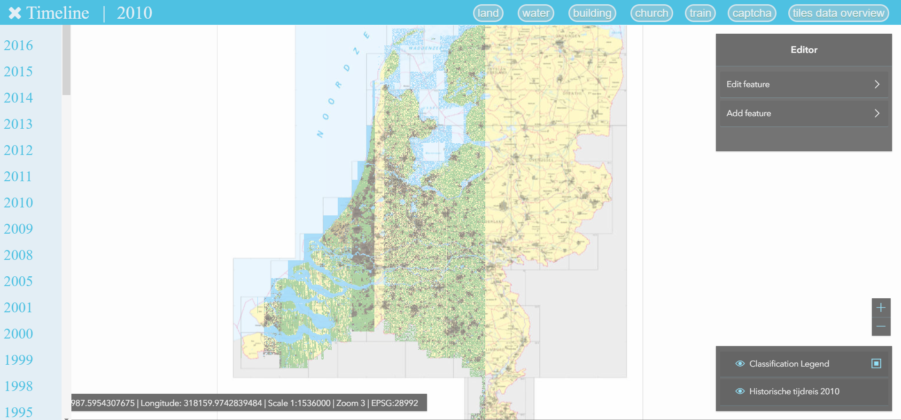
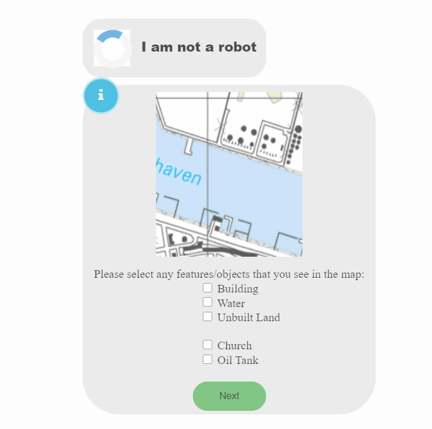
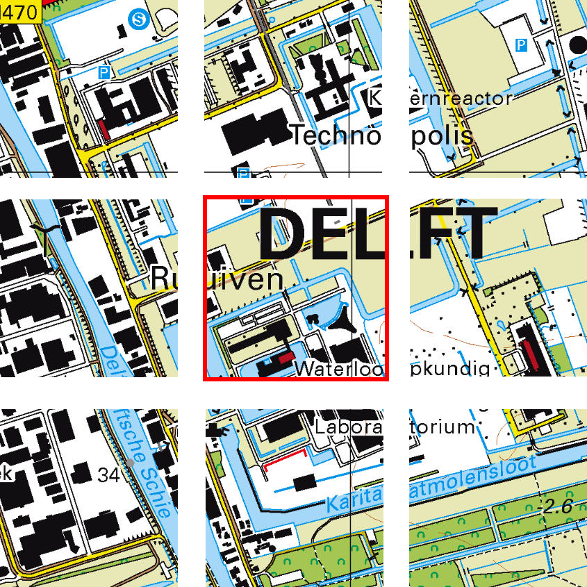

# Geomapping - map annotation tool  
The main driving aspect of this project is the fact that the maps of the Netherlands could be used to provide insights into human development, leading to a better understanding of urban planning for the future. Despite already being available online, they are merely images of maps and as such cannot provide too much meaningful information, much less be used for actual research. Had they been digitized though, the story would be completely different.  

This leads us to what we are trying to accomplish. We are setting the basis for a system that gathers data from its users and then uses that data (along with some simple predictions based on colours) to train a deep learning algorithm that can recognize elements on a map. From the shapes of rivers and cities, to more specific symbols such as churches and oil tanks, the time travelling algorithm will eventually be able to tell them all apart.

## Prerequisites
Python 3.7 interpreter  
Computer  
Interest in maps  

## Launching
1) Open the directory in command prompt (or bash if using Linux).  
2) Type in `pip install -r src/requirements.txt` to install the necessary packages. (First time only)  

>**NOTE:** Do not use the requirements.txt file in the root folder as that is only for our hosting and will not allow you to run everything.  

3) Type in `python src/manage.py runserver` to run the server.  
4) Open a browser and access `localhost:8000`  

## Built With
Python with Django - Back-end API, testing   
HTML, CSS, JavaScript - Front-end, CAPTCHAs  
Pip, npm - Dependency Management  
MySQL - Database  
ArcGIS - Map viewer

## Details
Python has been a strong candidate from the very beginning, since machine learning was involved. The need for a framework that could build a website and handle the security pushed us towards using Django. The fact that Django can also manage test suites was a welcome bonus. On the topic of testing, even though several static analysis tools were used, the main contribution in terms of code quality came from pylint and its high customizability. GitLab's Continuous Integration / Continuous Delivery pipeline helped us make sure that we were not introducing new bugs when we made a commit.  

Since a website was required, it was clear that the trio of HTML, CSS and JavaScript would be a part of our project. The main map viewer window is built using simple HTML and JavaScript to load and display the maps, and its minimalistic look was achieved through CSS. The CAPTCHA system required more attention, since the JavaScript used was more complex, but it kept the minimalistic features through the use of CSS.  

**Map Viewer**  
   

**CAPTCHA**  
  

Pip was a useful tool with regards to dependency management. Having all of the required libraries in one file, along with commands for easily installing them saved us a lot of time.  

The choice of a database was quite clear from the very beginning. Since we were not dealing with large amounts of data, a SQL system was considered to be enough. 99% of the time, saving an image file in a database is a bad idea. As such, we decided to store information such as the year and coordinates, since these can be used to uniquely identify a tile in a map and therefore, when a tile was needed, it could be retrieved.  

**Visualization of a tile (red outline)**  
  

  
The initial tile labels were assigned based on the colours present in the tiles. The library used for this is called extcolours. Given an existing image file's name as input, it counts how many times a pixel of each colour appears in the image. Using this, the label was determined by looking at the most dominant colour. Some features such as water or building presence were deemed important enough so that even a small amount of the colours that define them would lead to their labels being assigned as well.

## Authors
Boriss Berman  
Malina Bulina  
Georgi Genkov  
Paula Iacoban  
Andrei Stefan
