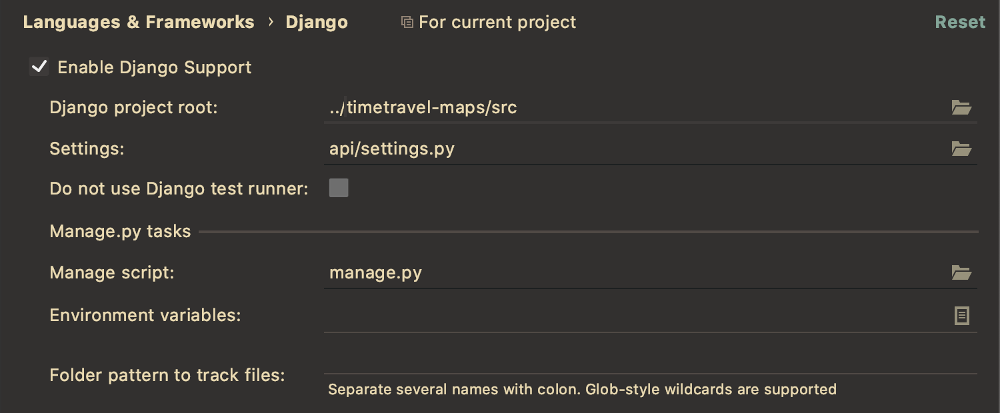

## HOW TO

#### detection.py

#### Helper functions:
- **possible labels**: 'building', 'land', 'water'
- **remove_images**: deletes all directories and subdirectories contained in the directory passed as an argument
- **get_images**: saves all the images from the database _(table dataset)_ in the current folder _(detection)_ based on their labels
- **save_labels**: save coordinates of the image in AITilesTable and the corresponding prediction in PredictionsTable
-- **train_validation_split**: split the saved images into training and validation sets _(shuffled)_ & remove the directories created after calling *get_images*
#### CNN:
1. constructor -> load pre-existing model or create an instance of Sequential
2. train -> train then validate the model and save/update it afterwards; delete the directories used in this step
3. predict -> classify the images from the specified table and store the labels in the database

### IMPORTANT

to be able to run detection.py, you need to configure Django, otherwise an error is raised:
`django.core.exceptions.ImproperlyConfigured: Requested setting INSTALLED_APPS, but settings are not configured. You must either define the environment variable DJANGO_SETTINGS_MODULE or call settings.configure() before accessing settings.`
