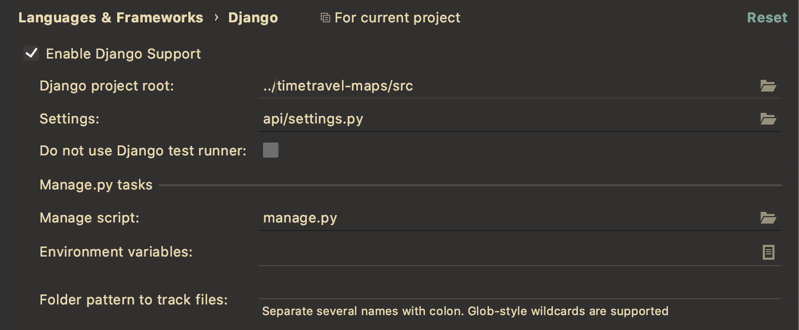

## HOW TO

#### detection.py

- **remove_images**: deletes all directories and subdirectories containing the labelled images
- **get_images**: saves all the images from the database _(table dataset)_ in the current folder _(detection)_ based on their labels
- **possible labels**: 'building', 'buildingland', 'buildinglandwater', 'buildingwater', 'land', 'landwater', 'water'
- **labels** can be changed to any of the values from the list _(no other changes needed)_

## STEPS:
1. get_images() -> take images from the database and store them in folders by their labels
2. train_validation_split() _(called in CNN(), TODO: add separate method)_ -> split the saved images into training and validation sets _(shuffled)_ & remove the directories made at step 1.
3. CNN magic _TODO: explain..._
4. remove_images -> leave no trace behind

**You may delete the cnn_baseline file;**
 
- if it exists, the CNN loads it,

- else the weights are i.i.d. in the beginning.

Better delete it because the CNN might have been trained with other labels. _(e.g.: X trains with land and water, Y takes the code and trains with water and building using previous weights)._
### IMPORTANT

to be able to run detection.py, you need to configure Django, otherwise an error is raised:
`django.core.exceptions.ImproperlyConfigured: Requested setting INSTALLED_APPS, but settings are not configured. You must either define the environment variable DJANGO_SETTINGS_MODULE or call settings.configure() before accessing settings.`
